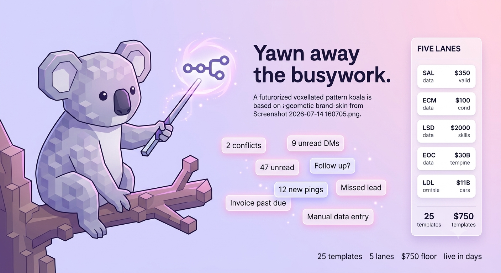

# Yawn — AI Automation Agency



**Automate the Boring. Wake Up Your Business.**

`Yawn` is a self-contained, full-stack platform designed to automate tedious tasks and empower businesses with advanced AI capabilities. Built with a kinetic brutalism design philosophy, it offers AI image generation, sophisticated web crawling with competitive intelligence, a site-wide AI chat agent, and per-user project history. The platform is engineered for ease of deployment, running anywhere with zero setup, no external database, and no third-party authentication. AI features gracefully fall back to deterministic mocks, ensuring every function works seamlessly even offline.

Recent enhancements include a comprehensive **AI-SEO foundation** with dynamic meta-data, JSON-LD, persona-based FAQs, and integrated tutorials for optimal search engine visibility. The backend has been significantly upgraded with robust **Supabase integration**, featuring organized migrations, secure email/password authentication with brute-force lockout, and a hardened security program. The user interface has undergone a **dark mode redesign** with a new Stackgrid layout, a catalog/pricing section, and a framer-motion koala mascot, complemented by cyber-grid background effects and page cursor interactions.

```bash
npm install
npm run dev
# → client  http://localhost:5173
# → server  http://localhost:3001
```

Open http://localhost:5173, click **Get Started** to sign in as the demo user, and explore.

---

## Features

- **AI-Powered Automation**: Generate images, crawl the web for competitive intelligence, and interact with a site-wide AI chat agent.
- **Comprehensive SEO Toolkit**: Dynamic meta-data, JSON-LD, persona-based FAQs, and integrated tutorials to boost search engine presence.
- **Secure User Management**: Supabase-backed email/password authentication with brute-force lockout and robust security protocols.
- **Intuitive UI/UX**: Kinetic Brutalism design with dark mode, Stackgrid layout, catalog/pricing sections, framer-motion koala mascot, and interactive cyber-grid background effects.
- **Zero-Config Deployment**: Runs locally without external databases or third-party auth; AI features include deterministic mock fallbacks for offline functionality.
- **Project History**: Track and manage per-user project history.

---

## Scripts

| Command            | What it does                                              |
| ------------------ | -------------------------------------------------------- |
| `npm run dev`      | Vite client (5173) + Express/tRPC server (3001), proxied |
| `npm run build`    | Production client build → `dist/`                         |
| `npm start`        | Serves the built client + API on a single port (3001)    |
| `npm run preview`  | `build` then `start`                                      |
| `npm run typecheck`| `tsc --noEmit`                                            |

---

## Tech stack

- **Client:** React 19, Vite 6, Tailwind CSS 4, wouter, framer-motion
- **Server:** Express 4, tRPC 11, zod
- **Database:** Supabase (Postgres) with Drizzle ORM, falling back to zero-config JSON store (`server/.data/`) for local development.
- **AI:** Pluggable providers (Anthropic / OpenAI / Firecrawl) with built-in mock fallbacks.
- **Authentication**: Supabase Auth with email/password and brute-force lockout.

---

## Configuration

Everything works with **no configuration**. To enable live providers, copy `.env.example` to `.env`
and set keys:

```bash
cp .env.example .env
```

| Variable             | Effect                                                      |
| -------------------- | ---------------------------------------------------------- |
| `ANTHROPIC_API_KEY`  | Use Claude for crawler intelligence + chat (else mock)      |
| `OPENAI_API_KEY`     | Use OpenAI for LLM **and** real image generation           |
| `FIRECRAWL_API_KEY`  | Route web scraping through Firecrawl (else native fetch)    |
| `SESSION_SECRET`     | Signs the session cookie — **change in production**         |
| `PORT`               | Server port (default `3001`)                               |
| `SUPABASE_URL`       | Supabase project URL for database and auth integration      |
| `SUPABASE_ANON_KEY`  | Supabase public API key                                     |

---

## How it runs off GitHub

The app has no hard external dependencies, so a fresh clone runs immediately:

- **Auth** — now powered by Supabase for robust email/password authentication with brute-force lockout. For local development, a self-contained signed-cookie session (`GET /api/auth/login` signs in the demo user) is still available. Replace `server/_core/auth.ts` with a real OAuth provider when ready; the rest of the app only relies on the signed `yawn_session` cookie.
- **Database** — integrated with Supabase (Postgres) via Drizzle ORM for scalable data management. For local development, a JSON file at `server/.data/store.json` serves as a zero-config fallback.
- **AI** — image gen returns branded brutalist SVGs and the LLM returns structured intelligence when no API keys are present.

### Deploy

`npm run build && npm start` serves the whole app (client + API) from one Node process — deployable
to any Node host (Render, Railway, Fly, a VM, etc.). For Vercel, host the API as a serverless/Node
function and the client as static output.

---

## Project structure

```
src/                 React client
  pages/             Home, Dashboard, ImageStudio, WebCrawler, ProjectHistory, Settings, Help, Catalog, Pricing
  components/        DashboardLayout, ChatAgent, RequireAuth, KoalaShowcase, ParticleField, Seo, SiteChrome, ui/*
  _core/hooks/       useAuth
server/              Express + tRPC API
  _core/             auth, cookies, env, llm, imageGeneration, scrape, systemRouter
  routers.ts         tRPC app router
  db.ts              JSON store
  schema.ts          Drizzle reference schema (Postgres)
shared/              constants shared by client + server
supabase/            Supabase migrations and configuration
public/              Static assets, including animations/yawn-koala and yawn-koala.png
```

---

## Design system

| Token        | Value                          |
| ------------ | ------------------------------ |
| Primary      | `#B666D2` rich lilac           |
| Secondary    | `#B9A3D9` light pastel purple  |
| Background   | `#ECDAF2` pale purple          |
| Ink / border | `#2D1B3D` near-black purple    |
| Typography   | Inter (400–900)                |
| Radius       | `0px` (hard edges)             |
| Borders      | `2px` solid                    |
| Signature    | `scale(0.97)` on `:active`     |

Built with accessibility in mind: visible focus rings, `prefers-reduced-motion` support, semantic
landmarks, and alt text throughout.

---

## Recent Updates

Over the past few months, the AI Automation Agency has seen significant advancements:

- **AI-SEO Foundation**: Implemented a robust AI-SEO framework, including dynamic meta-data generation, JSON-LD for structured data, persona-based FAQ sections, and integrated tutorials to enhance search engine visibility and user engagement.
- **Supabase Integration**: Migrated to Supabase for enhanced database management and secure user authentication. This includes organized database migrations, secure email/password authentication with brute-force lockout mechanisms, and a hardened security program to protect user data.
- **UI/UX Redesign**: Introduced a sleek dark mode, a redesigned Stackgrid layout for improved content organization, and new catalog and pricing pages. The visual experience is further enriched with a framer-motion koala mascot, cyber-grid background effects, and interactive page cursor effects.
- **Core System Hardening**: Enhanced server-side security, implemented real authentication flows, and refined the overall security program to ensure a stable and protected environment.

---

## License

[MIT License](LICENSE)

---

## Credits

Developed by DJ Batalona.
